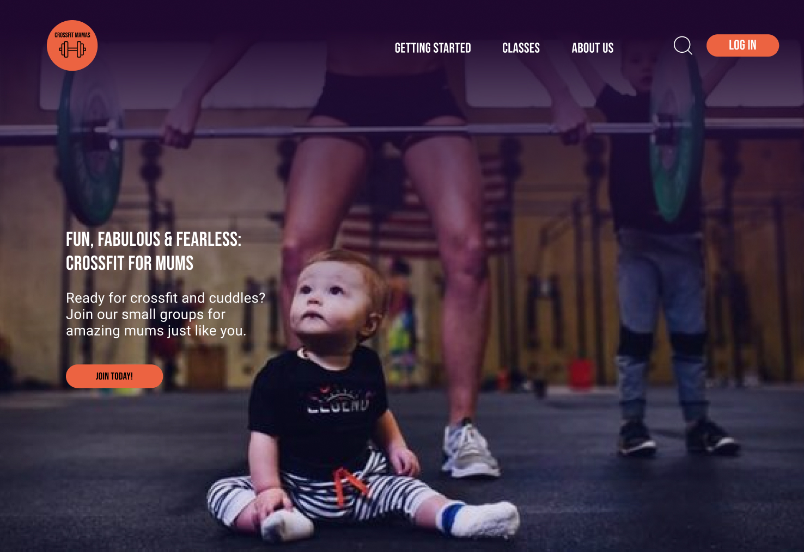

<h1 align="center">
  <a href="">
    
  </a>
</h1>

### Remove git

rm -rf .git

# Design Handoff Project

This is a landing page for signing up for mum crossfit classes. It is intended for new mums who has never tried crossfit before and want to work out and bring their baby. Also they want it to be a safe place where it is ok that you have to attend to your baby and that you perhaps never have worked out before but want to learn.The Crossfit Mama classes take place in an ordinary crossfit gym, but there are no regular classes in the gym while Mum classes are being held.CTAs are to join this mum crossfit community and once your a member you can also book classes from the web page.

A design is made for desktop, tablet and mobile. There are no other pages than the actual start page.

## Getting Started with the Project

### Dependency Installation & Startup Development Server

Once cloned, navigate to the project's root directory and this project uses npm (Node Package Manager) to manage its dependencies.

The command below is a combination of installing dependencies, opening up the project on VS Code and it will run a development server on your terminal.

```bash
npm i && code . && npm run dev
```

### The Problem

Describe how you approached to problem, and what tools and techniques you used to solve it. How did you plan? What technologies did you use? If you had more time, what would be next?

### View it live

(Crossfit Mamas)[https://technigo-project-design-handoff-vite.netlify.app/]

## Instructions

<a href="instructions.md">
   See instructions of this project
  </a>
